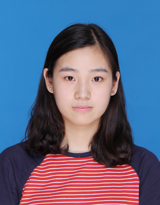
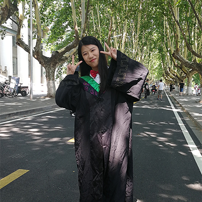
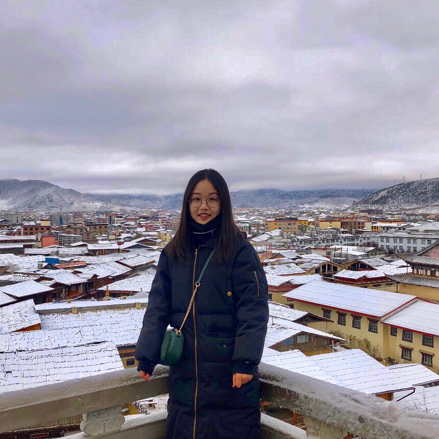

## Postdocteral Fellows

### Ran Xue
- Microbial "Dark matters"

### Yuanhui Liu
(co-superivsed with Prof. Jianming Xu)
- Root node and rhizosphere microbiomes

## Doctoral students

### Kankan Zhao
- Rhizosphere microbiomics

### Yiling Wang
- Viromes

## Master students

### Sudi Ye
- Microfluidics

### Shan Liu
- Phyllosphere microbiome

### Haoze Liu

###  Linya Xu

- The Microbiome of Hangzhou Bay

