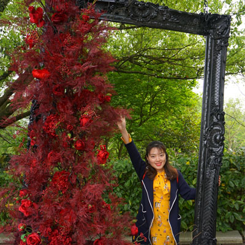
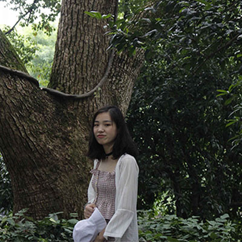

## Postdoctoral Fellows

#### Ran Xue
- Microbial "Dark matters"

#### Yuanhui Liu

(co-superivsed with Prof. Jianming Xu)

Dr. Yuanhui Liu has graduated from the China Agricultural University with a Ph.D. degree in microbiology in June 2018. In my Ph.D. research period, I have studied the mechanism underlying the Non-specific symbiosis between Sophora flavescens and different rhizobia. The research conducted in BMA lab focuses on the mechanism of nitrogen fixation efficiency of rhizobia in regulating the structure and function of soybean root microbiome, in order to understand how rhizobia affect the root microbiome through plant growth and metabolism.

## Doctoral students

#### Kankan Zhao

**We are turning the tide**

Kankan Zhao decided to pursue a Ph.D. in Soil Science after graduating from Zhejiang University with a degree of Bachelor of Agricultural Science in Agricultural Resources and Environment. His primary focus lies in using ecological theories and bioinformatics methods to reveal the interactions between rhizosphere microbial community members. Currently, he is exploring to apply time series analysis to unravel microbial community dynamics. He is also interested in soil viromes. 

#### Yiling Wang

**Anything but ordinary**

Yiling Wang holds a Agricultural Resources and Environment B.S.A. from the Zhejiang University. She is currently working on an exploration of the viromes in soil ecosystems. During the Ph.D study, her focus lies in the viruses and their prokaryotic hosts in rice rhizosphere soils to explore the dynamic variation of viral community structure and ascertain the complex interactions between viruses and prokaryotic hosts in rice rhizosphere. Her end goal is to understand the ecological functions of viral community in paddy ecosystems, increase the knowledge in carbon biogeochemical cycle in paddy ecosystems, and provide theoretical support for regulating ecological functions of paddy ecosystems. 

## Master students

#### Shudi Ye

Shudi Ye holds a landscape architecture B.Eng. from Zhejiang A&F University and has involved in drawing and modeling projects for several years. She joined us on 2018 summer and turned to construct micro-scale structure through her initiation of the design and microbiology from then on. Interested in the interaction between plant roots and microorganisms, Shudi is currently exploring a microfluidics setup to investigate the circadian rhythm of rhizosphere microbes. Additionally, she is also studying other research questions aiming at soil biology based on microfluidics-technologies.

#### Shan Liu

Shan Liu graduated from the Jiangxi Agricultural University with a Bachelor of Agriculture in agricultural resources and environmental in June 2018. After my graduated, I was lucky enough to enter BMA lab and became a member of the research group. My research project is Phyllosphere microbiome, and the main research content is its geographical distribution pattern and main driving factors. Although there are many difficulties in the process of research, I believe in where there is a way.

#### Haoze Liu

- The freshman, graduated in agriculture. Hope to make a contribution to our team.
- Come from Hulun Buir grassland, but not a tall figure.
- Curious about new things and want to try.
- Be serious about what I am doing.
- Art is the treasure of mankind. I love her three thousand.
- Like going outside, like staying at home.
- Believe that there is always someone who is better than us.

####  Linya Xu
- The Microbiome of Hangzhou Bay

Xu Linya comes from Jiangsu and she will graduate from Nanjing Agricultural University this summer. Her major is Agricultural resources and environment. She joined the BMA lab in March 2019 in order to dive more into microbiome research,especially the microbiomes of Hangzhou Bay. Her research topic is ‘The microbiomes and their ecological functions in the marine-terrestrial interlaced zone of the Hangzhou Bay’. 
