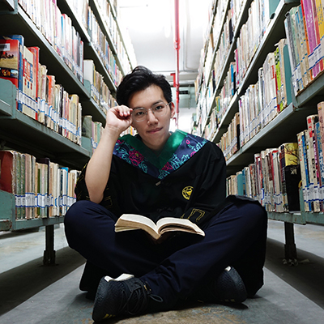

## Hengyi Dai
(*Support by "Agronomy+X" multi-discipline centre and co-superivsed with Prof. Yu Wu*)

Hengyi Dai holds an Agricultural Resources and Environment B.S.A. and has a minor in public administration from the Zhejiang University. He joined the BMA lab on 2019 summer and will work for his Ph.D. in Soil Science Cross Fluid Mechanics from 2020 fall.  His work focuses on the interaction of rhizosphere microorganisms based on microfluidic chips. Currently he is exploring the effects of free radicals on the activity of rice rhizosphere microbial community via microfluidics-technologies.

