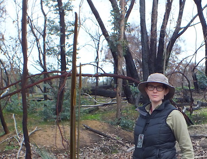

## *Dr. Erinne Stirling*

Erinne Stirling completed her PhD in 2019 at The University of Adelaide, South Australia with a thesis titled ‘Nutrient cycling between litters and soil after fire in native woodland and Pinus radiata plantations’. During her PhD, Erinne also worked as a freelance researcher on a number of projects including Australia’s Emissions Reduction Scheme, the microbial ecology of Acid Sulfate Soils, and drought effects in permanently and ephemerally saturated inland hydric soils. She was extensively involved in undergraduate teaching and community outreach of soil science. Erinne joined Bin’s laboratory in December, 2019 wherein she aspires to continue working in the soil ecology research and soils education workspace. Erinne is broadly interested in many aspects of soil science, including nutrient cycling, microbial interactions, abiotic chemistry and soil taxonomy.