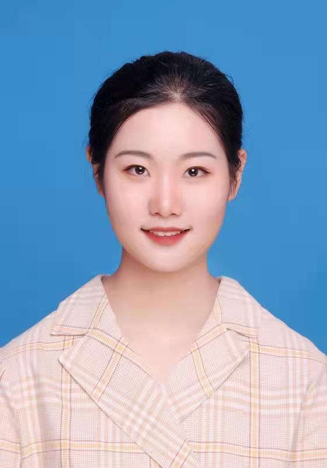

## *Youjin Jiang*

Jiang Youjin is a fourth year undergraduate majoring in clinical medicine and minoring in Finance at Zhejiang University. She has won the first-class scholarship of Zhejiang University twice and is a brave explorer reckless to try fresh, multidimensional things including her first scientific research project in microbma lab together with Zhang Zhenwen, aiming to use FACS-ichip system to mine some functional microorganisms.