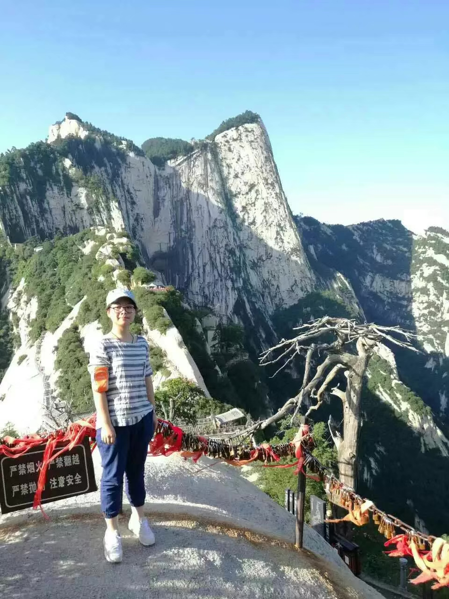

## *Huan Li*

**Barren Spring**

Huan Li graduated from Hefei University of Technology in June 2021. She majored in environmental engineering as an undergraduate and was eager to study soil pollution and microbes. It’s a great honor to be following in BMA Lab as a researcher after graduation. 
Currently, her primary focus lies in analyzing typical iron-reducing bacteria Geobacter and finding out its global distribution. Next step is studying interspecific interaction between geobacter and methanogens.
