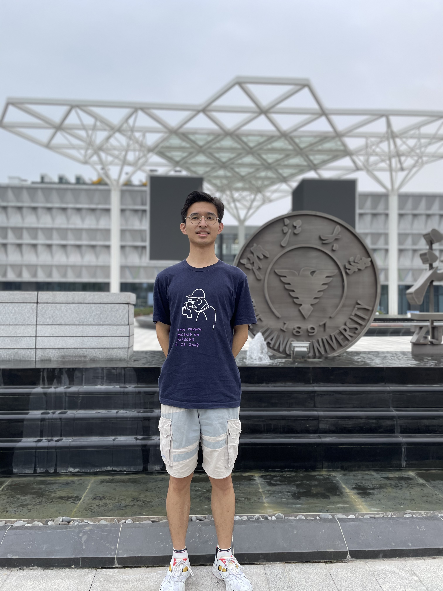

## *Master Tingfeng Shi*

Tingfeng Shi is an outgoing boy, always accompanied by laughter.He spent four unforgettable years at Zhejiang University and graduated with a bachelor's degree in Agricultural Resources and Environment in 2021.After taking the postgraduate entrance examination, he was fortunate to be admitted into microbma lab.Due to his understanding of soil science and interest in computers, he will study machine learning and the Earth Microbiome Project in the future to explore the possibility of using machine learning to predict community succession changes under different environmental factors.
