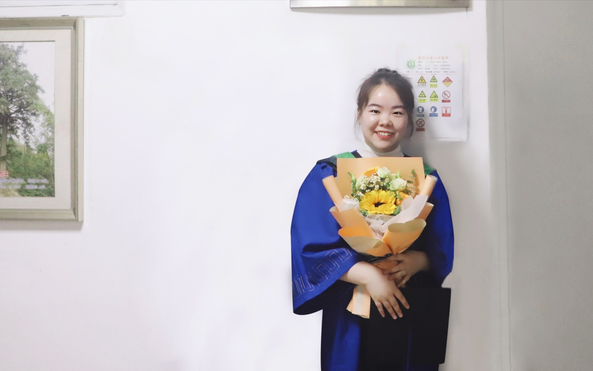

## *Yuyu Shi*

I come from Shanxi and had graduated from the Fujian Agriculture and Forestry University with a Master of Agriculture in June 2021. During the master's degree, I studied the response mechanism of Ectomycorrhizal fungus Cenococcum geophilum  to heavy metal cadmium. I'm very happy and honored to join BMA lab. Hope to contribute to the team. I believe that as long as you work hard, you will gain. The minute you think of giving up, think of the reason why you held on so long.