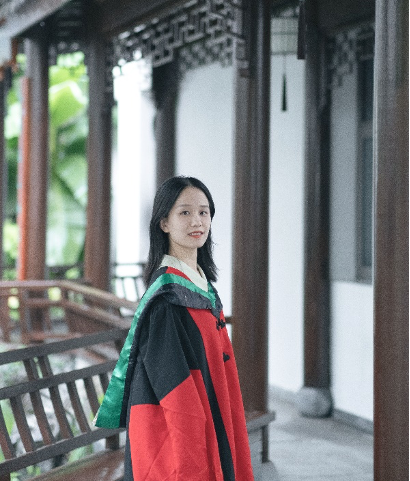

## *Jingwen Yu*

Jingwen Yu got her PhD in 2021 at Zhejiang University. During her PhD, she focused on the population genetics using genome wide association study. Jingwen Yu is interested in genome data mining, comparative genomics analysis and population evolution research. Dr. Yu joined BMA lab in September, 2021 with the project of pangenome research on Soil Microbes.