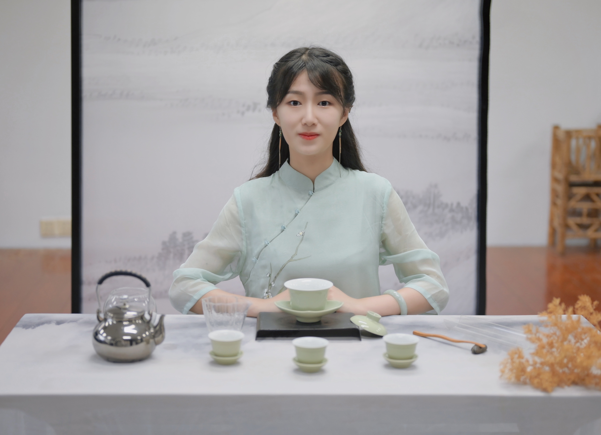

### Dr. Fan  Zhang

Fan Zhang got her PhD in 2021 at Zhejiang University. During her PhD, she worked in Texas A&M University and USDA-ARS for 1 year as a visiting scholar with the funding from CSC. Her doctoral dissertation focused on the molecular mechanism of the interaction between cotton and *Verticillium dahliae* from the perspective of multi-omics. Fan Zhang joined BMA lab in September, 2021 with the project of genome sequencing on multiple rice rhizosphere bacteria. She also interested in the small RNA interaction between plants and and microorganisms as well as CRISPR gene editing.