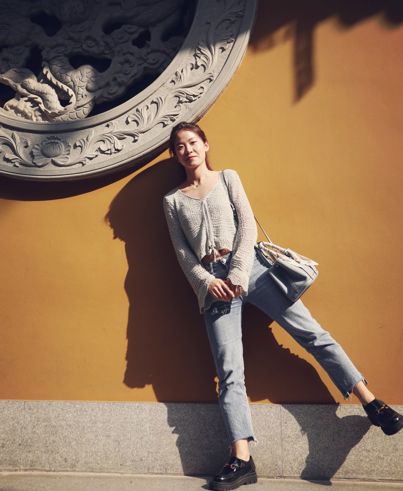

## *Luyao Zhang*

Luyao Zhang comes from Henan and she is a cheerful person. She graduated from Zhejiang A&F University in June 2021 after 3 years colorful life on campus with a Master's degree of agricultural resources and environment. Then she joined the BMA lab on 2021 summer and decided to pursue a Ph.D. in soil science in Zhejiang University. During the Ph.D study, she would like to deeply explore the connection between microbes and soil carbon cycle starting from the distribution of microbial functional genes on a global scale. Life is simple! She is fond of the phrase “you make choices and you don't look back”.