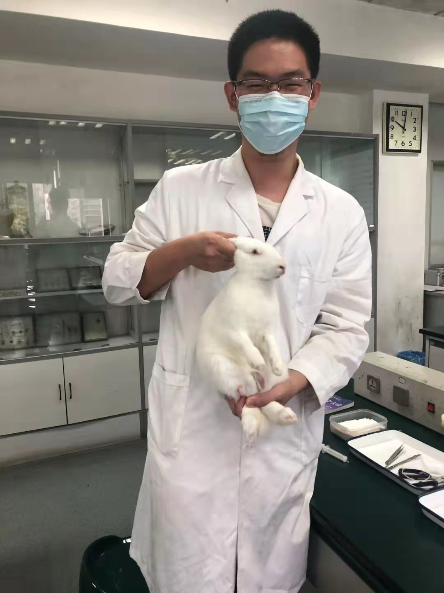

## *Zhengwen Zhang*

Zhang Zhenwen is a third year undergraduate majoring in Agricultural Resources and Environment from Zhejiang University. He has the height of an NBA player, but he is not a good basketball player. He is very lucky to carry out his first scientific research project in microbma lab. He hopes to use FACS-ichip system to mine some functional microorganisms.