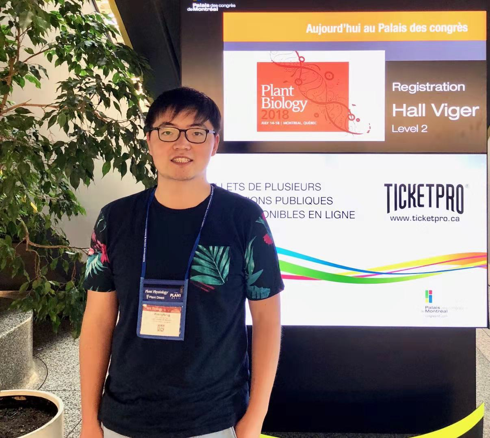
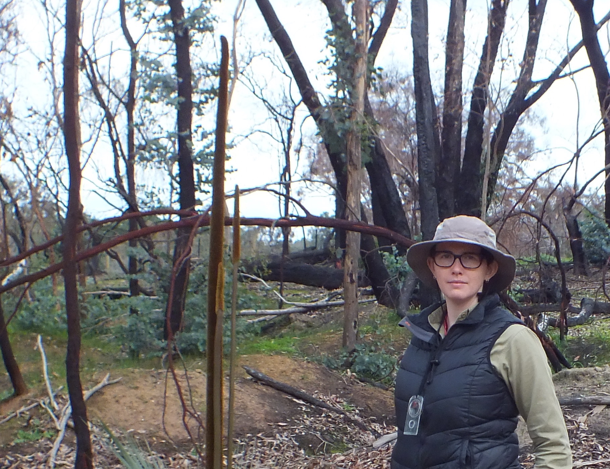

## Dr. Bin Ma

### Education

- Ph.D in Soil Science, Zhejiang University, Hangzhou, 2008-2012
- M. Ag in Grass Science, Lanzhou University, Lanzhou, 2004-2007
- B. Ag. in Grass Science, Lanzhou University, Lanzhou, 2000-2004

### Professional Experence

- 2017-present, Assistant Professor (the 100 talent project), Zhejiang University
- 2014-2017, Postdoctoral Fellow (LRIGS), University of Alberta
- 2012-2014, Assistant Researcher, Chinese Academy of Science

### Research Interests

#### Engineering Soil Microbiome
Mining and exploiting the microbiomes have crucial application potentials in soil nutrient utilization and plant health promotion. However, there is still a woeful shortage of precise design and validation systems in soil microbial research. The proposed project will design and assemble the functions of rice rhizosphere engineering microbiomes, aiming at sustainable development of agriculture, and will employ microbial complex networks and machine learning algorithms to achieve the directed regulation of rice rhizosphere engineering microbiome functions. Addressing the above scientific questions will provide a new framework for microbiome engineering and support the sustainable development of agriculture.

#### Systems Microbiology

Microbes wired with others through complex interactions. Systems biology provides a novel perspedctive for microbial ecology investigation that interaction networks of genes, proteins, microbes, and other factors in ecosystems play critical roles in regulating ecosystem functions. We are trying to explore the complex interactions in microbial communities by inferring microbial networks for genes, proteins, and microbes.

#### Rhizosphere Microbiomes

Rhizosphere microbiomes are essential for plant grwoth and health, and for ecosystem sustainability. However, our understanding in rhizosphere microbiomes is still unclear because of microbial "dark matters" and complex cross-talking between plant and rhizosphere microbiomes. We are digging microbial "dark matters" with FACS-iChip and are illustrating plant-microbe cross-talking mechanisms in rhizosphere with RhizoChip.

## Postdoctoral Fellows

### *Dr. Ran Xue*

Ran Xue received his Ph.D in Agriculture from Lanzhou University in 2017 including 2 years’ joint study in the University of Adelaide funded by CSC. During his PhD, Ran studied the interaction between microbial community and plant under water stress. He joined Bin’s lab in Jun, 2018, where he involves in “dark matter” or uncultured microbes in soil to excavate microbial resources for agriculture, manufacture and health care. Ran’s research interests also including bacteria cell size, active microorganism and microbial community assembly.

### *Dr. Xiangfeng Tan*

I received my PhD degree in Forest Biology and Management from the University of Alberta.  My thesis research mainly involved the roles of plant aquaporins under low oxygen conditions. I joined Dr. Ma's lab in July 2019 as a postdoc fellow, and have been studying the rhizosphere interactions between plants and microbes.  Benefiting from my backgrounds in ecology and plant science, I would like to keep expanding my research interests.

### *Dr. Erinne Stirling*

Erinne Stirling completed her PhD in 2019 at The University of Adelaide, South Australia with a thesis titled ‘Nutrient cycling between litters and soil after fire in native woodland and Pinus radiata plantations’. During her PhD, Erinne also worked as a freelance researcher on a number of projects including Australia’s Emissions Reduction Scheme, the microbial ecology of Acid Sulfate Soils, and drought effects in permanently and ephemerally saturated inland hydric soils. She was extensively involved in undergraduate teaching and community outreach of soil science. Erinne joined Bin’s laboratory in December, 2019 wherein she aspires to continue working in the soil ecology research and soils education workspace. Erinne is broadly interested in many aspects of soil science, including nutrient cycling, microbial interactions, abiotic chemistry and soil taxonomy.

### *Binhao Wang*

### *Hao Ren*

### *Fan Zhang*

## Research Assistant

### *Huiyun Dong*

### *Yuanyi Wu*

### *Yuyu Shi*

## Doctoral students

### *Kankan Zhao*
(co-superivsed with Prof. Jianming Xu and Prof. Philip C. Brookes)

**We are turning the tide**

Kankan Zhao decided to pursue a Ph.D. in Soil Science after graduating from Zhejiang University with a degree of Bachelor of Agricultural Science in Agricultural Resources and Environment. His primary focus lies in using ecological theories and bioinformatics methods to reveal the interactions between rhizosphere microbial community members. Currently, he is exploring to apply time series analysis to unravel microbial community dynamics. He is also interested in soil viromes. 

### *Yiling Wang*

**Anything but ordinary**

Yiling Wang holds a Agricultural Resources and Environment B.S.A. from the Zhejiang University. She is currently working on an exploration of the viromes in soil ecosystems. During the Ph.D study, her focus lies in the viruses and their prokaryotic hosts in rice rhizosphere soils to explore the dynamic variation of viral community structure and ascertain the complex interactions between viruses and prokaryotic hosts in rice rhizosphere. Her end goal is to understand the ecological functions of viral community in paddy ecosystems, increase the knowledge in carbon biogeochemical cycle in paddy ecosystems, and provide theoretical support for regulating ecological functions of paddy ecosystems. 

### *Hengyi Dai*
(*Support by "Agronomy+X" multi-discipline centre and co-superivsed with Prof. Yu Wu*)

Hengyi Dai holds an Agricultural Resources and Environment B.S.A. and has a minor in public administration from the Zhejiang University. He joined the BMA lab on 2019 summer and will work for his Ph.D. in Soil Science Cross Fluid Mechanics from 2020 fall.  His work focuses on the interaction of rhizosphere microorganisms based on microfluidic chips. Currently he is exploring the effects of free radicals on the activity of rice rhizosphere microbial community via microfluidics-technologies.

### *Xinwei Song*

Xinwei Song graduated from the Nanjing Agricultural University in June 2020. She majored in ecology as an undergraduate and was interested in soil microbes specifically. After she graduated, she was lucky enough to enter BMA lab and became a member of the research group. Her research project is bioremediation of soil composite pollution, and her main research content is the construction of ecological network of rhizosphere cooperative remediation of agricultural soil with combined pollution. Her final goal is to establish the rhizospheric interaction networks of plants-animals-microorganisms to accelerate the synergetic remediation of combined pollutants. Further, to find new methods to regulate the synergistic remediation in rhizosphere on combined pollutants in agricultural soils.

### Luyao Zhang

## Master students

### *Haoze Liu*

- The freshman, graduated in agriculture. Hope to make a contribution to our team.
- Come from Hulun Buir grassland, but not a tall figure.
- Curious about new things and want to try.
- Be serious about what I am doing.
- Art is the treasure of mankind. I love her three thousand.
- Like going outside, like staying at home.
- Believe that there is always someone who is better than us.

###  *Linya Xu*
- The Microbiome of Hangzhou Bay

Xu Linya comes from Jiangsu and she will graduate from Nanjing Agricultural University this summer. Her major is Agricultural resources and environment. She joined the BMA lab in March 2019 in order to dive more into microbiome research,especially the microbiomes of Hangzhou Bay. Her research topic is ‘The microbiomes and their ecological functions in the marine-terrestrial interlaced zone of the Hangzhou Bay’. 

### *Caiyu Lu*

Caiyu Lu comes from Henan Xinyang and has graduated from the Lanzhou University with a Bachelor of Agriculture-Forest Economic Management in June 2020. I'm very happy and honored to join BMA lab, and  I'm interested in the use of metagenomics in soil micro-ecosystem and the distribution and diversity of microbiome and functional genes on a global scale. 

**There is no luck, every effort is worth it.**

### *Yiqun Li*

I come from Taizhou and had graduated in land resource management. I feel lucky enough to be a member of BMA lab and hope that I can contribute to the cause of soil microorganism. For the reason of interest in the geographical distribution of soil Micro-organism, I decide to make great effort to the exploration of the wider and deeper Soil microecological world. Finally, I firmly believe that the harder you work, the luckier you are.

### *Huan Li*

**barren spring**

Huan Li graduated from Hefei University of Technology in June 2021. She majored in environmental engineering as an undergraduate and was eager to study soil pollution and microbes. It’s a great honor to be following in BMA Lab as a researcher after graduation. 

Currently, her primary focus lies in analyzing typical iron-reducing bacteria Geobacter and finding out its global distribution. Next step is studying interspecific interaction between geobacter and methanogens.

### *Tingfeng Shi*

## *Visiting Scientist*

### *Wenhao Yang*

### *Bin Wang*

## *Undergraduate Students*

### *Zhiwen Zhang*

## Lab alumni

### Postdoctoral fellows

#### *Dr. Yuanhui Liu* (China Rice Institute, CAAS) 

### Master students

#### *Shudi Ye* (Agriculture Academic of Zhejiang Provence)

#### *Shan Liu* (Jiangxi)

