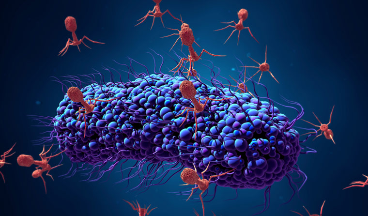
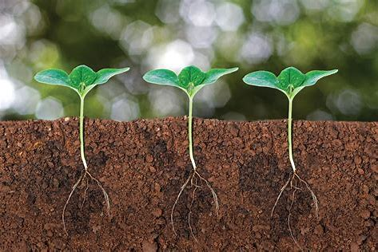

### [Global soil virus](/project/gsv.md)

 

(from www1.racgp.org.au)

We explore the viromes in soil ecosystems in global scale. We focus on relationships between viruses and their prokaryotic hosts in soil to explore the dynamic variation of viral community structure and ascertain the complex interactions between viruses and prokaryotic hosts.

### [Rhizosphere Circadiam Rythum Project](/project/rcr.md)

### [Soil Microbial Ecological Network](/project/network.md)

### [Plant Microbiome](/project/plant.md)

